# honray-ThirdPart
## 开发者中心自定义开发案例
1. 案例演示了自定义表单控件和自定义列表组件
2. 案例可以放在开发者中心基础开发版中src/components中运行查看效果
3. 更加具体的配置以及使用方式请参考惟快云 -> 惟快学院 -> 开发者中心

### 自定义表单控件-加密组件
> 在业务场景中，需要对一个字段进行加密存储，输出需要解密。

> 加密组件：对输入文本进行base64/md5加密

### 开发流程
#### 配置自定义页面组件
     
   
 
 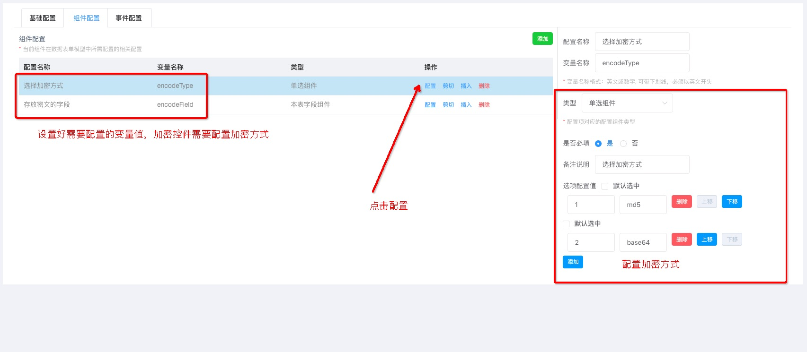
 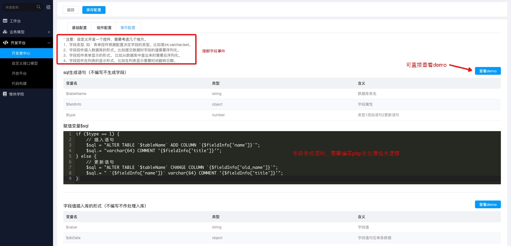
 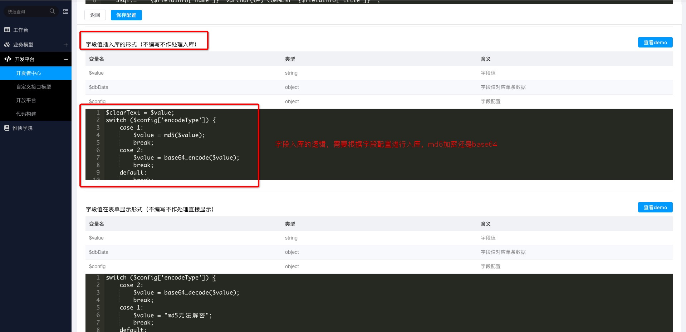
#### 使用自定义组件
 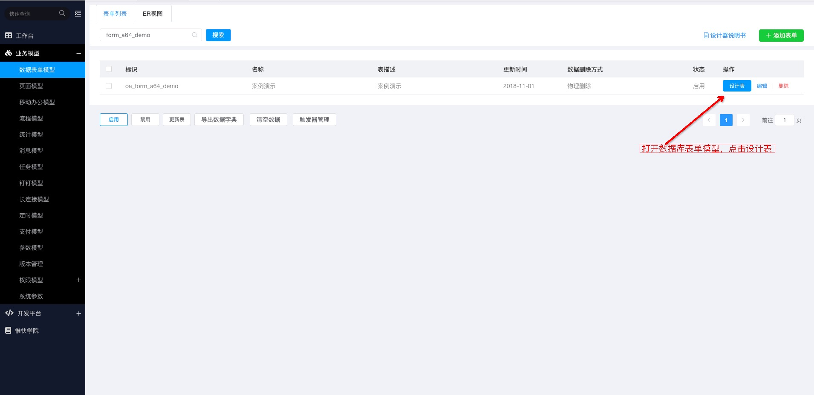
 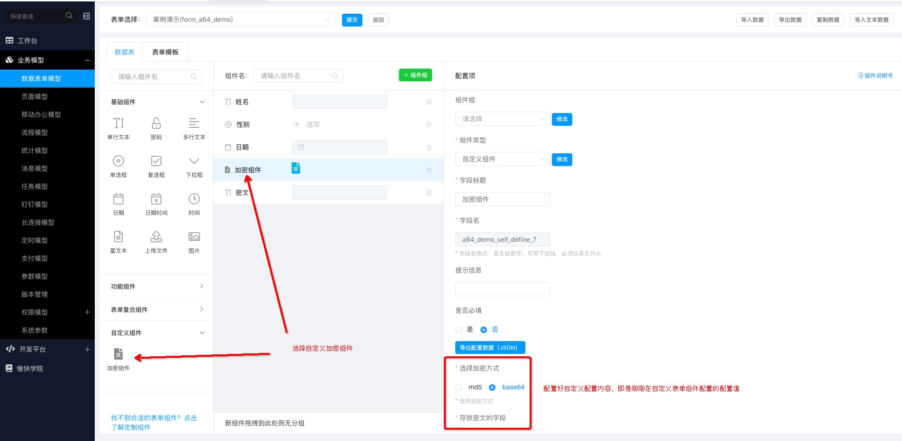
#### 实例化展示
 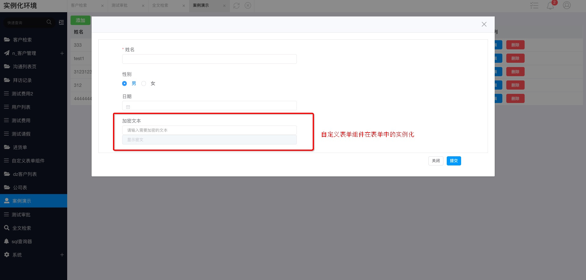

### 自定义页面组件-列表组件
> 自定义列表组件：显示表单数据，内置添加、编辑、删除按钮，点击这三个按钮会触发惟快云本身的添加、编辑、删除组件

### 开发流程
#### 配置自定义页面组件
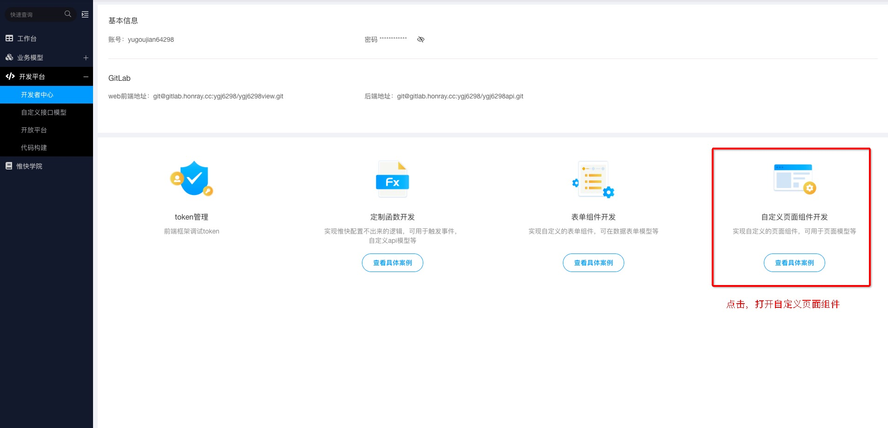
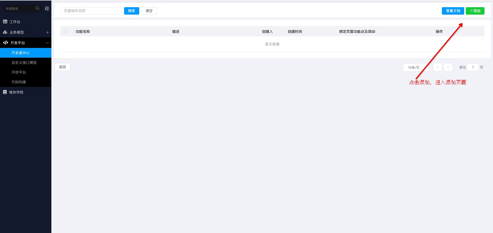
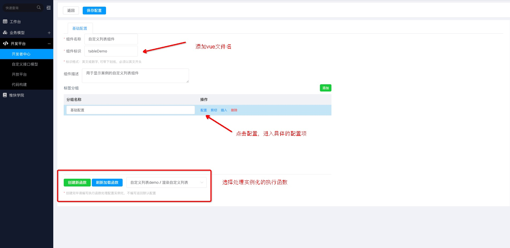
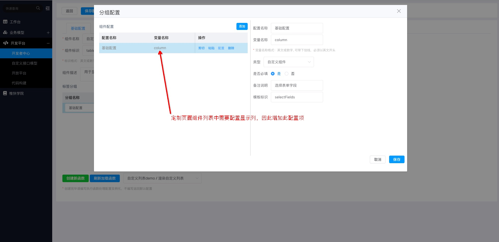
#### 执行函数逻辑
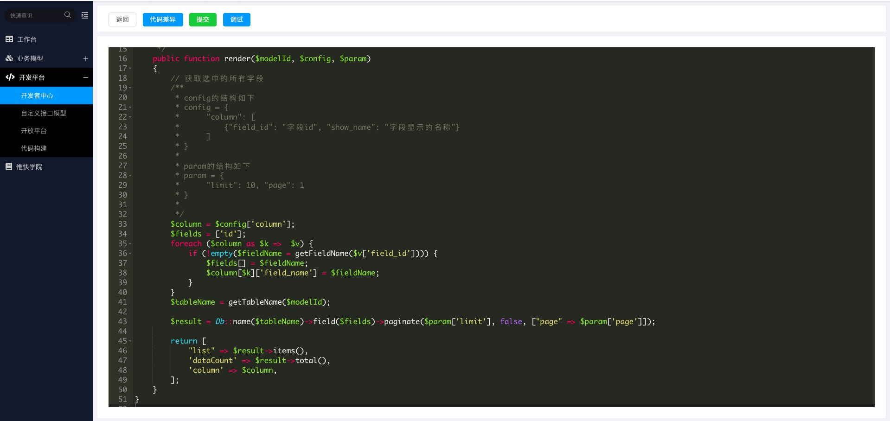
#### 使用自定义页面组件

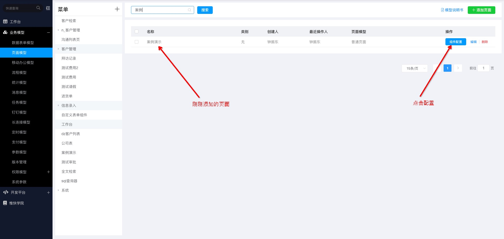
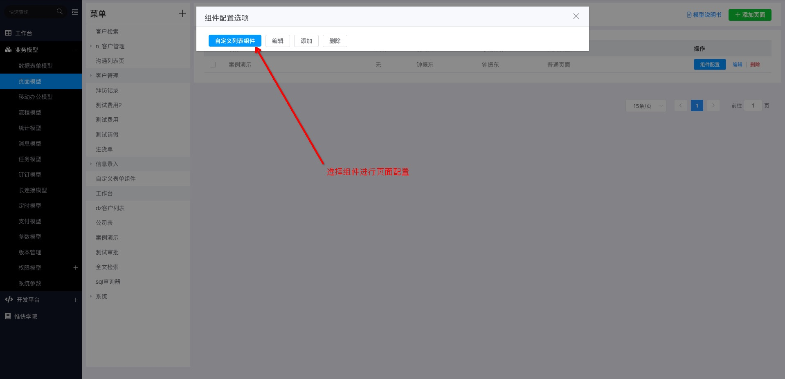
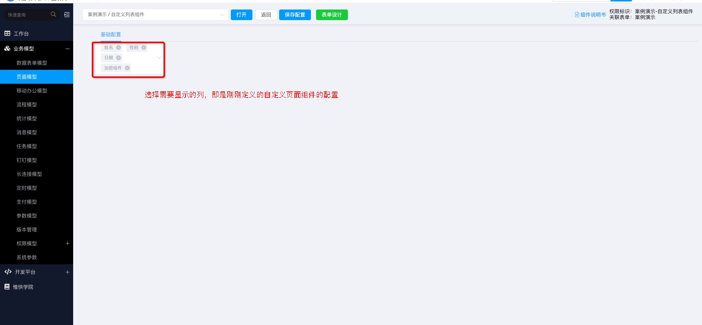
#### 实例化展示
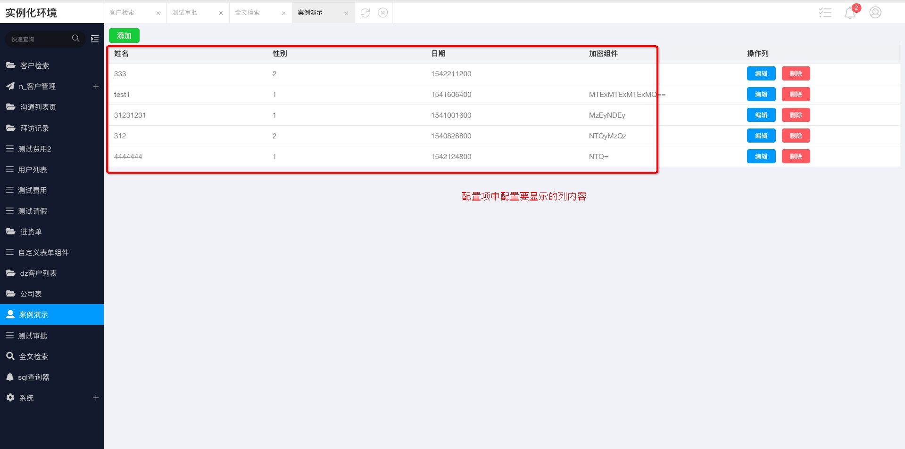
 

